[](https://github.com/gongahkia/the-junior-associate/releases/tag/1.0.0)
[](https://www.python.org/downloads/)
[](https://opensource.org/licenses/MIT)

> [!NOTE]
> `The Junior Associate` is a comprehensive Python library for legal case law scraping designed for researchers, practitioners, and developers.

# `The Junior Associate` ⚖️

`The Junior Associate` is a [polished](#architecture) Python library that provides [easy-to-use scrapers](#usage) for legal case law from [multiple jurisdictions](#support) worldwide.

It serves [Legal Research](#features) with [Unified API](#features), [Error Handling](https://docs.python.org/3/tutorial/errors.html), [Multi-jurisdiction Coverage](#support) and [Command Line Interface](#usage).

## Stack

* *Language*: [Python](https://www.python.org/)
    * *HTTP Requests*: [requests](https://docs.python-requests.org/), [urllib3](https://urllib3.readthedocs.io/)
    * *HTML Parsing*: [BeautifulSoup4](https://www.crummy.com/software/BeautifulSoup/), [lxml](https://lxml.de/)
    * *Date Handling*: [python-dateutil](https://dateutil.readthedocs.io/)
    * *Text Processing*: [charset-normalizer](https://charset-normalizer.readthedocs.io/)
* *CLI*: [argparse](https://docs.python.org/3/library/argparse.html)
* *Package*: [setuptools](https://setuptools.pypa.io/)
* *Testing*: [pytest](https://docs.pytest.org/), [pytest-cov](https://pytest-cov.readthedocs.io/)
* *Linting*: [black](https://black.readthedocs.io/), [flake8](https://flake8.pycqa.org/), [mypy](https://mypy.readthedocs.io/)
* *Pre-commit*: [pre-commit](https://pre-commit.com/)

## Usage

The below instructions are for running `The Junior Associate` on your client machine.

1. Execute the below.

```console
$ git clone https://github.com/gongahkia/the-junior-associate && cd the-junior-associate
```

2. To use `The Junior Associate` [CLI](./the_junior_associate/cli.py), run the below.

```console
$ junior-associate search courtlistener "constitutional law" --limit 5
```

3. Alternatively, install from PyPI for library usage.

```console
$ pip install the-junior-associate
```

4. Most commonly, you would include `The Junior Associate` directly as a [Library](https://docs.python.org/3/library/index.html) within your projects.

### [Search](./the_junior_associate/scrapers/) Cases Across Jurisdictions

```py
from the_junior_associate import CourtListenerScraper

with CourtListenerScraper() as scraper:
    cases = scraper.search_cases(
        query="privacy rights",
        start_date="2023-01-01",
        limit=10
    )

    for case in cases:
        print(f"{case.case_name} - {case.date}")
        print(f"Court: {case.court}")
        print(f"URL: {case.url}")
```

### [Retrieve](./the_junior_associate/scrapers/) Specific Cases by ID

```py
from the_junior_associate import CanLIIScraper

with CanLIIScraper() as scraper:
    case = scraper.get_case_by_id("2023 SCC 15")
    print(f"Case: {case.case_name}")
    print(f"Judges: {', '.join(case.judges)}")
```

### [Multi-jurisdiction](./the_junior_associate/scrapers/) Research

```py
from the_junior_associate import CourtListenerScraper, BAILIIScraper, AustLIIScraper

scrapers = [
    ("US", CourtListenerScraper()),
    ("UK", BAILIIScraper()),
    ("AU", AustLIIScraper())
]

query = "data protection"
all_cases = []

for jurisdiction, scraper in scrapers:
    with scraper:
        cases = scraper.search_cases(query=query, limit=5)
        for case in cases:
            case.metadata["jurisdiction"] = jurisdiction
            all_cases.append(case)
```

### [Batch Process](./the_junior_associate/utils/) with Error Handling

```py
from the_junior_associate import IndianKanoonScraper
import logging

case_ids = ["AIR 2023 SC 1234", "AIR 2023 SC 5678"]

with IndianKanoonScraper() as scraper:
    for case_id in case_ids:
        try:
            case = scraper.get_case_by_id(case_id)
            if case:
                print(f"Retrieved: {case.case_name}")
        except Exception as e:
            logging.error(f"Failed to retrieve {case_id}: {e}")
```

## Support

> [!NOTE]
> Each jurisdiction's scraper handles document types such as court decisions, judgments, and case law which can be viewed [here](./the_junior_associate/scrapers/).
>
> To get a new jurisdiction **added** or to **suggest improvements** to existing scrapers, please [open an issue](https://github.com/gongahkia/the-junior-associate/issues).

`The Junior Associate`'s [jurisdiction](https://dictionary.cambridge.org/dictionary/english/jurisdiction)-aware scrapers currently support the following legal databases.

| Database | Jurisdiction | Coverage | Status |
|----------|-------------|----------|---------|
| [CourtListener](./the_junior_associate/scrapers/courtlistener.py) | United States | Federal & State Courts | ✅ Active |
| [FindLaw](./the_junior_associate/scrapers/findlaw.py) | United States | Supreme Court & State Law | ✅ Active |
| [AustLII](./the_junior_associate/scrapers/austlii.py) | Australia/New Zealand | Commonwealth & State Courts | ✅ Active |
| [CanLII](./the_junior_associate/scrapers/canlii.py) | Canada | Federal & Provincial Courts | ✅ Active |
| [BAILII](./the_junior_associate/scrapers/bailii.py) | UK & Ireland | All UK & Irish Courts | ✅ Active |
| [Singapore Judiciary](./the_junior_associate/scrapers/singapore_judiciary.py) | Singapore | Official Court Judgments | ✅ Active |
| [Indian Kanoon](./the_junior_associate/scrapers/indian_kanoon.py) | India | Federal & State Courts | ✅ Active |
| [HKLII](./the_junior_associate/scrapers/hklii.py) | Hong Kong | Appellate & Tribunal Cases | ✅ Active |
| [Légifrance](./the_junior_associate/scrapers/legifrance.py) | France | Supreme & Administrative Courts | ✅ Active |
| [German Law Archive](./the_junior_associate/scrapers/german_law_archive.py) | Germany | Selected Federal Court Cases | ✅ Active |
| [Curia Europa](./the_junior_associate/scrapers/curia_europa.py) | European Union | ECJ & General Court | ✅ Active |
| [WorldLII](./the_junior_associate/scrapers/worldlii.py) | International | Global Legal Databases | ✅ Active |
| [WorldCourts](./the_junior_associate/scrapers/worldcourts.py) | International | International Court Cases | ✅ Active |
| [Supreme Court of India](./the_junior_associate/scrapers/supremecourt_india.py) | India | Official Supreme Court | ✅ Active |
| [Kenya Law](./the_junior_associate/scrapers/kenya_law.py) | Kenya | Kenyan Court Cases | ✅ Active |
| [Supreme Court of Japan](./the_junior_associate/scrapers/supremecourt_japan.py) | Japan | Japanese Supreme Court | ✅ Active |
| [ICC Legal Tools](./the_junior_associate/scrapers/legal_tools.py) | International | International Criminal Law | ✅ Active |

## Architecture

```mermaid
%%{init: {'theme': 'base', 'themeVariables': { 'primaryColor': '#fff5e6', 'edgeLabelBackground':'#fff'}}}%%
flowchart TD
    classDef tests fill:#D1E0FF,stroke:#333;
    classDef scrapers fill:#D1FFD1,stroke:#333;
    classDef utils fill:#FFFFD1,stroke:#333;
    classDef root fill:#FFD1D1,stroke:#333;

    subgraph ROOT["the-junior-associate (Root)"]
        direction TB
        setup["setup.py"]:::root
        pyproject["pyproject.toml"]:::root
        requirements["requirements.txt"]:::root
        manifest["MANIFEST.in"]:::root
    end

    subgraph PACKAGE["the_junior_associate/"]
        direction TB
        __init__["__init__.py"]
        cli["cli.py"]

        subgraph SCRAPERS["scrapers/"]
            direction TB
            __init_scrapers["__init__.py"]
            courtlistener["courtlistener.py"]
            findlaw["findlaw.py"]
            canlii["canlii.py"]
            austlii["austlii.py"]
            bailii["bailii.py"]
            singapore["singapore_judiciary.py"]
            indian_kanoon["indian_kanoon.py"]
            hklii["hklii.py"]
            legifrance["legifrance.py"]
            german["german_law_archive.py"]
            curia["curia_europa.py"]
            worldlii["worldlii.py"]
            worldcourts["worldcourts.py"]
            supreme_india["supremecourt_india.py"]
            kenya["kenya_law.py"]
            supreme_japan["supremecourt_japan.py"]
            legal_tools["legal_tools.py"]
        end

        subgraph UTILS["utils/"]
            direction TB
            __init_utils["__init__.py"]
            base["base.py"]
            data_models["data_models.py"]
            exceptions["exceptions.py"]
            helpers["helpers.py"]
        end
    end

    subgraph TESTS["tests/"]
        direction TB
        conftest["conftest.py"]
        test_scrapers["test_scrapers/"]
        test_utils["test_utils/"]
        integration["integration/"]
    end

    %% Relations
    cli --> courtlistener
    cli --> canlii
    cli --> austlii
    cli --> bailii

    courtlistener --> base
    canlii --> base
    austlii --> base
    bailii --> base
    singapore --> base
    indian_kanoon --> base

    base --> data_models
    base --> exceptions
    base --> helpers

    test_scrapers --> courtlistener
    test_scrapers --> canlii
    test_utils --> base
    integration --> cli

    %% Class assignments
    class setup,pyproject,requirements,manifest root
    class __init,cli scrapers
    class courtlistener,findlaw,canlii,austlii,bailii,singapore,indian_kanoon,hklii,legifrance,german,curia,worldlii,worldcourts,supreme_india,kenya,supreme_japan,legal_tools scrapers
    class base,data_models,exceptions,helpers utils
    class conftest,test_scrapers,test_utils,integration tests
```

